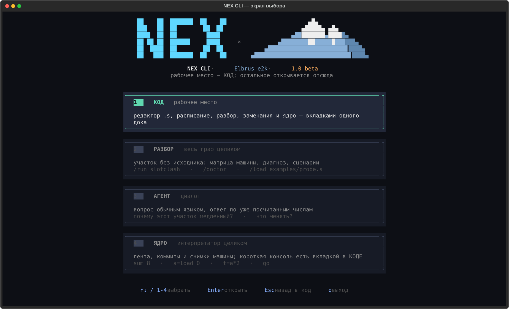
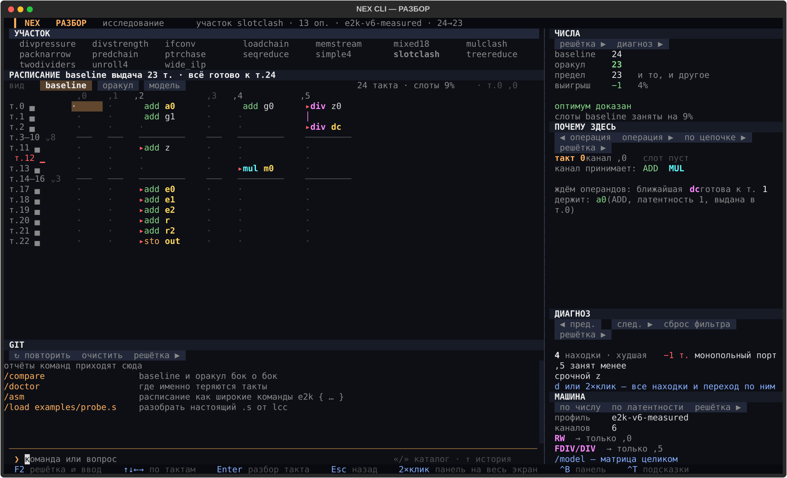

# Планировщик инструкций для VLIW (Эльбрус e2k)

Прототип к исследовательскому проекту «ИИ-планировщик инструкций для
VLIW-архитектур» — но то, чем стоит пользоваться и что реально работает
здесь, это не обученная модель, а точный расчёт на откалиброванной модели
машины. Главный тезис проекта:

> **планировщик широких команд принимает жадные необратимые решения, и на
> реалистичной модели машины у стандартной эвристики есть измеримый,
> доказуемый разрыв до оптимума — вот бюджет, за который имеет смысл
> бороться обученной моделью.**

ИИ-трек в проекте есть и работает (обучен, веса опубликованы), но
результат самой этой борьбы — отрицательный, и это не спрятано: подробно
и с методикой — в разделе [«Что здесь измеряется»](#что-здесь-измеряется)
ниже.

Работает на голом Python 3.10+. Ни `lcc`, ни `qemu-e2k-static`, ни LLVM здесь
не нужны и не вызываются. Единственная **опциональная** зависимость — `rich`
(см. [ниже](#про-опциональный-rich)); без неё всё полностью работает на ANSI.

**Один режим, два способа вызова.** Без аргументов — логотип, дефолтный вывод
и интерактивный цикл; с командой — один запуск и выход (быстрый режим для
скриптов). Команды одни и те же: снаружи без «/», внутри цикла с «/».

```bash
cd vliw-ai-scheduler-demo      # ВАЖНО: команды ниже — из папки проекта
pip install -e ".[tui]"        # рабочее место (textual) — так задумано
python3 -m vliw                # рабочее место: экран выбора, дальше РАЗБОР/КОД/АГЕНТ
python3 -m vliw run slotclash  # то же самое, сразу на участке slotclash
```

`run`, `load`, `compare`, `doctor`, `bounds`, `path`, `analyze` — команды про
ОДИН участок, и открывают рабочее место на нём, а не печатают отчёт текстом.
Так они ведут себя всегда, когда есть терминал и рабочее место установлено.

Массовые прогоны по многим графам разом печатают текст — им нечего показывать
одним экраном:

```bash
python3 -m vliw all            # сводка по всем сценариям
python3 -m vliw scenarios      # список сценариев
python3 -m vliw sweep          # массовый прогон по случайным графам
python3 -m vliw selfcheck      # сверить оракул полным перебором
```

Текстовый вывод остаётся и для команд про один участок — это путь для
скриптов, пайпов и CI, а не альтернативный способ пользоваться инструментом:
`python3 -m vliw --no-color run slotclash > out.txt` или в перенаправленном
выводе (`| grep`, отсутствие терминала) — тогда рабочее место не открывается
физически, потому что открывать его некуда.

> Если видите `No module named vliw` — вы не в папке проекта, сначала `cd`.
> Если `python: command not found` — на вашей системе интерпретатор
> называется `python3` (используется во всех примерах выше). Больше типичных
> проблем и полный разбор каждой команды — в **[docs/CLI.md](docs/CLI.md)**.
> На Windows — **[docs/WINDOWS.md](docs/WINDOWS.md)**: установка, `py`
> вместо `python3`, и отдельно — что делать, если АГЕНТ отвечает «нет сети».

**Рабочее место подробно, режим за режимом:** [КОД](docs/CODE_MODE.md) —
каждая клавиша и проводник; [РАЗБОР](docs/LAB_MODE.md) — решётка и все семь
панелей; [ЯДРО](docs/CORE_MODE.md) — коротко, это калькулятор с историей;
[промты для АГЕНТА](docs/AGENT_PROMPTS.md) — готовые вопросы и честная
оговорка про точность ответов. Полное оглавление документации, включая
журнал исследования, — **[docs/README.md](docs/README.md)**.

**Хотите покопаться в коде, а не только пользоваться** — начните с
[docs/ENTHUSIAST.md](docs/ENTHUSIAST.md): что можно менять в интерфейсе, как
обучить свою модель, как писать скрипты — и честно про то, что закрыто и
почему.

## Установка для разработки

```bash
git clone <your-fork-url> vliw-ai-scheduler
cd vliw-ai-scheduler
pip install -e ".[tui]"   # ядро работает и без extras; TUI — с ними
python -m unittest discover -s tests
```

Короткий старт на английском — в [QUICKSTART.md](QUICKSTART.md),
правила для контрибьюторов — в [CONTRIBUTING.md](CONTRIBUTING.md).

## Что здесь измеряется

Единственная метрика — **число тактов** (makespan) на одном и том же графе
зависимостей и одной и той же модели машины:

| | |
|---|---|
| **baseline** | жадный list scheduler с приоритетом по длине остаточного критического пути — то, что стоит в реальных компиляторах (`kind="heuristic"`) |
| **oracle** | точный поиск (branch-and-bound с итеративным углублением) — недостижимый на практике теоретический *потолок* (`kind="exact"`) |

**Про терминологию.** Оракул — это НЕ «ИИ» и не обученная модель, а точный
математический поиск оптимума. Обученная модель (LoRA поверх Qwen2.5-3B,
веса на [Hugging Face](https://huggingface.co/Shmonika/nex-vliw-lora), запуск
— [`vliw/learned/`](vliw/learned/README.md)) в проекте есть и работает, но
результат измерения — отрицательный, и это не спрятано: на настоящем выводе
`lcc` (графы 112–386 узлов) модель не обошла обычный случайный перебор ни на
одном графе из 13, суммарно +0 тактов (методика и `VERIFY.sh` —
[`real_candidates_100_400/model_eval/`](real_candidates_100_400/model_eval/REPORT.md)).
Оракул остаётся верхней планкой качества и источником эталонных расписаний
независимо от того, как ведёт себя модель.

## Результаты

```
  сценарий      N  модель           нижн.гр.  baseline  oracle  выигрыш  оптимум
  simple4       7  e2k-v6-measured        13        13      13  —        доказан
  loadchain    16  e2k-v6-measured        12        12      12  —        доказан
  mixed18      19  e2k-v6-measured        23        23      23  —        доказан
  slotclash    13  e2k-v6-measured        22        23      22  -1 (4%)  доказан
  mulclash     12  e2k-v6-measured        21        21      21  —        доказан
  divpressure  19  e2k-v6-measured        14        20      20  —        доказан
  wide_ilp     63  e2k-v6-measured        11        13      13  —        не доказан
  memstream    24  e2k-v6-measured         7        11      10  -1 (9%)  доказан
```

> **Эти числа — вторая редакция.** Первая версия модели была неверна, и в
> README стояли совсем другие цифры (`slotclash −9 тактов, 22%`,
> `mulclash −7, 21%`). Разбор ошибки — в разделе
> [«Как модель оказалась неверной»](#как-модель-оказалась-неверной-и-что-это-меняет)
> ниже; он важнее самих чисел.

Два вывода, оба важные и оба честные:

**1. Разрыв у эвристики есть, но он маленький, и источник у него ровно один —
дефицитный порт.** По-настоящему монопольный исполнитель на e2k один: делитель
(порт `,5`, ассемблер отказывается кодировать `sdivs` где-либо ещё). Плюс
дефицитна запись — она кодируется только в `,2` и `,5`. Жадный планировщик
work-conserving: если дефицитный порт свободен, а какая-то операция для него
готова, он её выдаёт — даже если результат никому не нужен срочно. `slotclash`
ловит это на делителе, `memstream` — на канале записи. Оба разрыва по одному
такту и оба доказаны точным поиском; честный масштаб проблемы — единицы
процентов, а не десятки.

**2. Размер разрыва почти целиком определяется тем, насколько точно описана
машина, — и это проверяемо.** `python3 -m vliw sweep` гоняет случайные графы
по всем конфигурациям машины, включая **опровергнутую первую версию модели**,
оставленную в проекте специально для такого сравнения (ниже вывод `sweep
--seeds 20 --sizes 10,12,14`, 60 графов на строку):

```
  модель                кан.  слоты          с разрывом  доля  средний разрыв  макс, тактов
  e2k-v6-measured          6  неравноправны        1/60    2%              3%             1
  e2k-v6-measured/w4       4  неравноправны        1/60    2%              3%             1
  e2k-v6-measured/w3       3  неравноправны        1/60    2%              3%             1
  e2k-v6-firstprobe        6  неравноправны        4/60    7%             18%            15
  e2k-v6-firstprobe/w4     4  неравноправны        4/60    7%             18%            15
  e2k-v6-firstprobe/w3     3  неравноправны        6/60   10%             12%             9
  naive_homogeneous        6  равноправны          0/60    0%               —             —
  naive_homogeneous/w4     4  равноправны          0/60    0%               —             —
  naive_homogeneous/w3     3  равноправны          0/60    0%               —             —
```

Читать так: на **неверной** модели (`firstprobe`, где умножителю ошибочно
приписана монополия) жадная эвристика «проигрывает» в 7% графов на 18% тактов.
На **проверенной** — в 2% графов на 3%, максимум один такт. На модели
«все порты равноправны» — не проигрывает вовсе. То есть большая часть «разрыва,
за который стоило бы бороться обученной моделью», существовала не в железе, а
в ошибке описания железа.

Механизм оставшегося разрыва виден на `slotclash` (23 такта против 22
оптимальных):

- тупиковое деление `z0` независимо и готово в такте 0, но его результат
  никому не нужен срочно; критическое деление `dc` ждёт свой операнд `a0` и
  готово лишь к такту 1;
- эвристика в такте 0 видит свободный делитель и готовое `z0` — и занимает им
  единственный делитель;
- критическое `dc` из-за этого сдвигается: делитель принимает новое деление
  раз в два такта, и весь критический путь съезжает;
- оптимум придерживает делитель, отдаёт его `dc`, а `z0` считает позже, в тени
  критической цепочки.

Природа проблемы общая: приоритет по критическому пути видит длину цепочек и
слеп к тому, что дефицитный порт нельзя тратить на работу, которой никто не
ждёт. Но честный масштаб этой проблемы на проверенной модели — единицы тактов,
и делать вид, что там десятки процентов, нельзя.

## Как модель оказалась неверной (и что это меняет)

Первая версия модели строилась по ОДНОМУ листингу `lcc -O3 -S` для `probe.c` с
четырьмя независимыми делениями и четырьмя умножениями. Все четыре `muls` легли
в канал `,0` одно за другим — и это прочли как «умножитель на e2k один и держит
порт 8 тактов». Отсюда пошли сценарий `mulclash`, «21% разрыва» и вся линия про
«две монополии».

Проверка показала, что это ошибка метода, а не опечатка:

- **8 независимых умножений** вместо четырёх — и компилятор сам поставил
  `muls,0` и `muls,1` **в одну широкую команду**. Одного этого достаточно,
  чтобы «умножитель один» перестало быть правдой;
- **16 независимых умножений** идут по одному в такт подряд, без разрывов —
  значит устройство конвейеризовано, порт свободен уже в следующем такте;
- **ассемблер** (а не планировщик) отвечает на вопрос про каналы прямо:
  `$LCC -c` на `.s` с `muls,2` печатает `Error: 'muls' cannot be encoded in
  ALC2`. Перебором всех шести каналов получена матрица: `muls` — `,0 ,1 ,3 ,4`,
  `sdivs` — только `,5`, `stw` — только `,2 ,5`, `ldw` — `,0 ,2 ,3 ,5`.

Заодно поехали и латентности, снятые тем же ненадёжным способом. Цепочки
ЗАВИСИМЫХ операций (компилятор обязан развести их ровно на латентность) дали:
MUL **4** такта вместо 8, DIV **11** вместо 13, LOAD **5** вместо 2. Потоки
НЕЗАВИСИМЫХ дали темп приёма: MUL — каждый такт, DIV — раз в два такта (а не
«держит порт 13 тактов»).

Общий урок, который дороже конкретных чисел: **по выводу компилятора видно
то, что компилятор ЗАХОТЕЛ сделать, а не то, что железо МОЖЕТ.** Жадный
планировщик не станет занимать второй канал, если ему хватает первого, — и
наблюдатель принимает это за физическое ограничение.

Что с этим сделано в проекте:

- `vliw/core/model.py` перезаполнен по проверенным данным, у каждого параметра
  проставлен источник (`проверено ассемблером` / `цепочка зависимых` /
  `поток независимых` / `допущение`) — видно в `/model`;
- ошибочная модель **оставлена** как профиль `e2k-v6-firstprobe`, чтобы разницу
  можно было увидеть, а не только прочитать: `/model e2k-v6-firstprobe`;
- сценарий `mulclash` не удалён, а переписан: теперь это экспонат в группе
  «проверка модели» — на проверенной модели разрыва нет, на `firstprobe` есть;
- пробы и **настоящий** вывод компилятора сложены в
  [`examples/probes/`](examples/probes/README.md) вместе с методикой;
- прежняя «иллюстрация» `examples/probe.s`, нарисованная руками под неверную
  модель, помечена как экспонат (`probe_ILLUSTRATION_OBSOLETE.s`) и заменена
  настоящим выводом `lcc`.

`wide_ilp` — граница применимости прототипа: 63 инструкции, точный поиск не
укладывается в бюджет, включается запасной портфельный перебор. Он не нашёл
ничего лучше baseline, но и оптимальность не доказал. В отчёте так и
написано — не «разрыва нет», а «разрыв не найден».

## Не только планировщик: приёмы оптимизации

Всё выше — про работу ПЛАНИРОВЩИКА: один граф, две раскладки, разрыв между
ними. Но на e2k чаще теряется другое: планировщик уже выжал всё, а такты всё
равно уходят, потому что дело в самом коде. Вторая половина сценариев
(`/scenarios`, группы «форма графа», «цена операции», «циклы», «память»,
«ветвления») собрана парами «как написано» → «как надо»:

```
  сценарий      N  нижн.гр.  baseline  oracle  выигрыш  что показывает
  seqreduce    16        13        13      13  —        acc += v[i]: цепочка, ILP = 1
  treereduce   16         9        10      10  —        та же свёртка деревом
  divpressure  19        14        20      20  —        4 деления на единственном ,5
  divstrength  19         4         5       5  —        те же 4 операции сдвигом
  unroll4      12        12        12      12  —        развёртка работает, мешает память
  ptrchase     23        32        32      32  —        p = p->next: цепочка по памяти
  memstream    24         7        11      10  -1 (9%)  запись живёт лишь в ,2 и ,5
  ifconv       13         9         9       9  —        обе ветви условия посчитаны
```

Колонка «выигрыш» пустая почти везде — и это ровно то, что нужно показать:
**точный поиск не даёт ничего, потому что оптимизировать надо не расписание.**
Смысл в сравнении СОСЕДНИХ строк, а не baseline с oracle:

- `seqreduce` → `treereduce`: то же число инструкций, 13 тактов против 10.
  Свёртка в один аккумулятор не параллелится в принципе; помогает
  реассоциация в исходнике (для плавающей точки — только явно, она меняет
  порядок округления).
- `divpressure` → `divstrength`: 20 тактов против 5. Деление — единственная
  настоящая монополия машины: порт `,5`, новое деление раз в два такта,
  результат через одиннадцать. Замена на сдвиг (или вынос обратного значения
  из цикла) выигрывает больше, чем любое улучшение планировщика.
- `unroll4`: развёртка честно работает — умножения расходятся по четырём
  каналам и не мешают друг другу. Участок держит не арифметика, а латентность
  загрузки в 5 тактов: выигрыш даст подъём загрузок повыше, а не ещё одна
  развёртка.
- `ptrchase`: 32 такта на шести зависимых загрузках — самый длинный участок в
  наборе, и ни один планировщик его не сократит: адрес следующей загрузки
  известен только после предыдущей.
- `memstream`: единственный из этой группы, где разрыв есть. Причина не в
  вычислениях — запись кодируется только в двух каналах (`,2` и `,5`), и
  эвристика тратит дефицитный слот не в том порядке.
- `ifconv`: спекулятивно посчитанные обе ветви условия достаются даром, пока
  в них универсальные операции; поставьте туда деление — и получится
  `slotclash`.

Числа в таблице считает сам инструмент (`python3 -m vliw all`), в текст они
не зашиты.

## Интерактивный режим

Один экран и пристыкованные окна, как в IDE: редактор ассемблера e2k слева,
живой разбор расписания прямо в номерах строк, вкладки снизу (расписание,
замечания, вывод, ядро). Открывается `python3 -m vliw` без аргументов —
сначала экран выбора:



Дальше — рабочее место КОДа, разбор реального `.s` от `lcc`:


Тот же экран текстом, если картинки не грузятся:

```
▍NEX  slots.s ✕  probe.s ✕                 15→8 т. · 15 оп. · e2k-v6-measured
    11  т0     muls,0 %r10, %r11, %r20
──────────────────────────────────────────────────────────────────────────────
  расписание   разбор   замечания   вывод   ядро    15 т. −7  как написано  оракул
    т0      т1      т2      т3      т4
 ,0  muls    muls    muls    muls    muls
  F5 прогнать   F6 переписать   F12 док   ^P команда   ^G спросить
```

Остальные экраны — РАЗБОР (весь граф, решётка тактов×каналов, диагноз),
АГЕНТ (диалог) и полноэкранное ЯДРО (верстак интерпретатора) — открываются
по `/clear` или `^O` и возвращают обратно по `Esc`:



**Каждый экран описан отдельно, кнопка за кнопкой:**
[КОД](docs/CODE_MODE.md) — редактор, проводник, все вкладки дока и оговорка
про F6; [РАЗБОР](docs/LAB_MODE.md) — решётка и все семь панелей;
[ЯДРО](docs/CORE_MODE.md) — коротко, это калькулятор с историей. Полная
документация по CLI (команды, флаги, Tab-дополнение, история, разбор
проблем) — [docs/CLI.md](docs/CLI.md).

### Про опциональные зависимости

Обязательных зависимостей у проекта нет. **Весь функционал — цвет, рамки,
воспроизведение, интерактивный цикл, разбор и диагностика — работает на голом
ANSI и стандартной библиотеке.** Опциональных две:

| пакет | что даёт | без него |
|---|---|---|
| `textual` | три полноэкранных режима: верстак интерпретатора, интерактивная решётка расписания, диалог с трассой | построчный режим: те же команды, вывод лентой |
| `rich` | панели вокруг заметных блоков отчётов | те же блоки рамками из ANSI |

Если в окружении установлен
[`rich`](https://github.com/Textualize/rich), заметные блоки (логотип, вердикт,
справочные панели) дополнительно оформляются его панелями — это косметика с
автоматическим graceful fallback, если библиотеки нет:

```bash
pip install rich    # единственная опциональная зависимость, не обязательна
```

## Калибровка модели машины

Числа получены экспериментально: тестовые `.c` с независимыми операциями
скомпилированы кросс-компилятором `lcc-1.29.16 -O3 -fverbose-asm -S` (таргет
e2k-v6) и прогнаны под `qemu-e2k-static`; дальше читались готовые широкие
команды в `.s`. Латентности видны по разнице номеров bundle — компилятор
кодирует задержку явными `nop N`, что позволяет читать тайминги без публичной
документации на систему команд.

### Матрица возможностей портов — спрошена у ассемблера

Читать листинг компилятора и делать выводы о железе **ненадёжно**: видно то,
что планировщик захотел сделать, а не то, что машина может (именно на этом и
построена [ошибка первой версии](#как-модель-оказалась-неверной-и-что-это-меняет)).
Поэтому матрица снимается иначе: для каждой пары (операция, канал) собирается
крошечный `.s` и отдаётся **ассемблеру**. Нельзя — получаем прямой отказ:

```
Error: `muls' cannot be encoded in ALC2
```

Это утверждение про кодировку широкой команды, то есть про само железо.
Перебором всех шести каналов для каждой операции получилось:

| Операция | Каналы | Латентность | Темп приёма | Источник |
|---|---|---|---|---|
| `adds`/`subs`/`ands`/`shls` | все шесть `,0`…`,5` | 1 такт | 1/такт | ассемблер + цепочка |
| `muls`/`muld` | `,0 ,1 ,3 ,4` (четыре) | 4 такта | 1/такт | ассемблер + цепочка |
| `sdivs` | **только `,5`** | 11 тактов | раз в 2 такта | ассемблер + цепочка |
| `ldw`/`ldd` | `,0 ,2 ,3 ,5` | 5 тактов | 1/такт | ассемблер + цепочка |
| `stw`/`std` | **только `,2 ,5`** | 2 такта | 1/такт | ассемблер + цепочка + попарная проба |

Латентности мерялись **цепочками зависимых** операций (`x = x * b` подряд:
компилятор обязан развести их ровно на латентность), темп приёма — **потоками
независимых** (шаг между выдачами). Четыре `muls` в одной широкой команде
собираются успешно — ограничения «не больше двух умножений сразу» на уровне
кодировки нет.

Вывод, зашитый в модель: у e2k не «шесть взаимозаменяемых АЛУ», а **матрица
возможностей** порт → допустимые операции. Но настоящая монополия в ней ровно
одна — **делитель**; вторая по дефицитности вещь — запись (два канала).
Умножитель узким местом не является.

Отчёт печатает источник каждого параметра — чтобы измеренное не смешивалось
с придуманным. Отсюда три профиля машины:

- **`e2k-v6-measured`** (по умолчанию) — матрица, проверенная ассемблером,
  латентности сняты цепочками. То, во что стоит верить.
- **`e2k-v6-firstprobe`** — **опровергнутая** первая версия: «единственный
  умножитель на `,0`, держит порт 8 тактов», DIV 13/13, LOAD 2. Оставлена
  специально, чтобы разницу можно было увидеть своими глазами, а не только
  прочитать: `/model e2k-v6-firstprobe`, затем `/run slotclash`.
- **`naive_homogeneous`** — вырожденный контраст: 6 полностью равноправных
  каналов, любая операция на любом. Показывает случай, где выбор порта вообще
  не является решением.

Ключевой результат прототипа как раз и состоит в том, что *ответ на вопрос
«нужен ли тут ИИ» полностью зависит от матрицы возможностей портов*. Раньше
этот параметр был допущением — теперь он измерен, и измерение показало ту
самую монополию портов, при которой разрыв между эвристикой и оптимумом
возникает.

### Сочетания операций: второй класс ограничений

Матрица портов отвечает на вопрос «исполнима ли операция в этом канале» — по
одной операции за раз. Тем же приёмом можно спросить и про **пары**: собрать
широкую команду из двух операций, каждая из которых по отдельности законна, и
посмотреть, примет ли её ассемблер. Полный перебор находит ровно два запрета:

```
Error: the combination of STORE in ALC2 with LOAD in ALC3 is prohibited
Error: the combination of STORE in ALC5 with LOAD in ALC0 is prohibited
```

Остальные 117 сочетаний законны — включая `STORE,2 + LOAD,0` и
`STORE,5 + LOAD,3`. То есть запрет не «запись плюс загрузка вообще», а именно
эти две пары каналов: `(2,3)` и `(5,0)` — «швы» между кластерами `,0 ,1 ,2` и
`,3 ,4 ,5`. **Кластерность машины существует и наблюдаема, но проявляется как
структурный запрет в широкой команде, а не как межкластерная задержка.**

Саму межкластерную задержку локальным тулчейном снять **нельзя**, и это
проверено, а не предположено: ассемблер регистровых зависимостей не
отслеживает вообще (зависимая пара в соседних тактах принимается молча), а
компилятору нельзя приказать, в какой кластер класть операцию — из `.c` каналы
не выбираются. Ставить задержку в модель «по документации» значило бы
повторить ровно ту ошибку, из-за которой пришлось заводить профиль
`e2k-v6-firstprobe`.

В модель запреты пока **не заведены**, и это осознанный порядок работ, а не
недосмотр: точный поиск опирается на свойство «двудольное паросочетание
существует ⟺ набор выдаваем в этом такте», и запрет на пары его ломает —
менять пришлось бы ядро доказательства оптимальности. Расхождение сторожит
сама проверка: `python -m vliw verify` перебирает пары при каждом прогоне и
ругается, если набор запретов изменится. Разбор — в
[`examples/probes/README.md`](examples/probes/README.md).

## Как это устроено

Проект разведён по слоям: **логика ничего не печатает, визуализация ничего не
считает, склейка — тонкая.**

```
vliw/
  core/            ЛОГИКА (ничего не печатает, не знает про цвет/rich)
    model.py         модель машины: матрица возможностей портов, латентности, монополия
    dag.py           граф зависимостей, тестовые сценарии, нижние границы
    schedule.py      расписание (такт, порт) + полная валидация
    api.py           протокол Scheduler (контракт всех планировщиков)
    baseline.py      жадный list scheduler        (kind="heuristic")
    oracle.py        точный поиск + запасной движок (kind="exact")
    doctor.py        диагностика: где теряются такты и почему (правила)
    asm_parser.py    разбор настоящего .s от lcc → граф + расписание компилятора
    selfcheck.py     независимая проверка оракула полным перебором
  ui/              ВИЗУАЛИЗАЦИЯ (берёт данные из core, рендерит; ANSI + rich)
    render.py        цвет, ширина, рамки, таблицы, панели
    theme.py         палитра из themes/*.json (роли + цвета операций)
    themes/*.json    сами темы: nex-dark (по умолч.), classic
    logo.py          пиксельный баннер NEX + гора Эльбруса, статус-строка
    tables.py        таблицы сценариев/результатов/матрицы/sweep/selfcheck
    schedule_view.py пачки-рамки, вердикт, границы, критический путь, разбор
    context.py       панель контекста сессии (она же команда /status)
    slash.py         палитра «/»: фильтр команд по группам, подстановка аргументов
  tui/             ПОЛНОЭКРАННЫЙ ИНТЕРФЕЙС (Textual; единственный fullscreen)
    screens/         КОД (рабочее место) + РАЗБОР / АГЕНТ / ЯДРО
    widgets.py       панели, палитра «/», док ввода, умная вставка
  learned/         ОБУЧЕННАЯ МОДЕЛЬ: LoRA поверх Qwen2.5-3B, локальный запуск
    runtime.py       поиск весов, зависимости, llama.cpp-сервер, генерация
    scheduler.py     LearnedScheduler(kind="learned") — рабочая реализация
    portfolio.py     CAB: несколько законных расписаний из одного ответа
    repair.py        починка незаконных каналов в сыром ответе модели
    bench.py         замер на любом .jsonl, отвязан от встроенного эвала
    README.md        интерфейс, формат промпта, ссылка на веса на HF
  cli.py           ЕДИНАЯ точка входа: команда → core → ui → печать
  __main__.py      тонкий: вызывает cli.main()
docs/
  CLI.md           полная документация по CLI: команды, флаги, ввод, проблемы
```

Все планировщики реализуют один протокол `Scheduler` из `core/api.py` —
и классификация честная:

```python
GreedyListScheduler   kind = "heuristic"   # baseline
OracleScheduler       kind = "exact"       # точный поиск (потолок), НЕ «ИИ»
LearnedScheduler      kind = "learned"     # обученная модель — обучена и работает

    def schedule(self, dag, model) -> SchedulingResult:  # общий контракт
        ...
```

Всё остальное — валидация, метрики, объяснения, CLI, визуализация — работает
с любым планировщиком, реализующим этот метод. Обученная модель уже лежит в
[`vliw/learned/`](vliw/learned/README.md), не переделывая `core`/`ui`/`cli`, —
контракт и задумывался ради этого. Оракул остаётся верхней планкой для
сравнения независимо от того, как ведёт себя модель.

### Почему оракулу можно верить

Оракул объявляет свои расписания оптимальными — заявление, которому нельзя
верить на слово: ошибка в отсечении дала бы «доказанный оптимум», который
оптимумом не является, и всё демо превратилось бы в подтасовку. Поэтому
`core/selfcheck.py` содержит второй, намеренно тупой планировщик — полный перебор
всех подмножеств готовых инструкций и всех назначений каналов, без единого
умного отсечения.

Прогон на 5472 задачах (случайные графы 5–8 инструкций × машины шириной 2–3 ×
оба профиля) расхождений не дал: там, где оракул заявляет оптимальность, его
makespan совпадает с полным перебором, и нижняя граница ни разу не оказалась
выше истинного оптимума. Плюс каждое выданное расписание проходит валидацию
(зависимости, ширина команды, возможности портов, монопольное занятие) —
это проверяется и в CLI, на каждом прогоне.

```bash
python -m vliw selfcheck --seeds 40 --time-limit 120
```

## Ограничения прототипа

- Модель машины игрушечная: нет регистрового давления, спекуляции,
  предикатов, обращений к памяти сложнее «load с фиксированной латентностью».
  Настоящий e2k устроен сложнее по всем пунктам.
- **Ограничений на сочетания операций внутри широкой команды в модели нет —
  а у машины они есть, и они измерены.** Ассемблер отвергает ровно две пары:
  запись в `,2` вместе с загрузкой в `,3` и запись в `,5` вместе с загрузкой
  в `,0`. Это «швы» между кластерами каналов (`,0 ,1 ,2` и `,3 ,4 ,5`).
  Пробел зафиксирован проверкой (`python -m vliw verify` печатает его при
  каждом прогоне), а не забыт — [подробности и почему в модель пока не
  заведено](#сочетания-операций-второй-класс-ограничений).
- Матрица возможностей портов снята у ассемблера и в этой части надёжна, но
  проверены только те операции, что есть в модели (`adds`/`subs`/`ands`/`shls`,
  `muls`/`muld`, `sdivs`, `ldw`/`ldd`, `stw`/`std`). Всё остальное богатство
  системы команд e2k не рассматривалось вовсе.
- Латентности сняты с КОМПИЛЯТОРА, а не с железа: это то, во что верит `lcc`
  при планировании. Совпадение с реальными тактами на живой машине пока не
  проверено — для этого нужен доступ к серверу Эльбрус.
- Величину разрыва на реальном коде прототип не измеряет: она зависит от того,
  как часто в коде рядом оказываются готовое некритическое и критическое
  действия, которым нужен один и тот же дефицитный порт.
- Точный поиск начинает не укладываться в бюджет примерно с 30 инструкций;
  дальше работает портфельный перебор без гарантий.
- Планируется один прямолинейный участок кода: ни ветвлений, ни циклов,
  ни программной конвейеризации.

## Что дальше

1. Проверить латентности на ЖИВОМ железе, а не только по вере компилятора
   (доступ к серверам Эльбрус по заявке через dev.mcst.ru). Матрица портов уже
   снята надёжно — у ассемблера; под вопросом именно тайминги. Там же и только
   там снимается межкластерная задержка: локальным тулчейном она не измеряется
   в принципе (см. [выше](#сочетания-операций-второй-класс-ограничений)).
2. Завести измеренные запреты на сочетания в модель отдельным профилем.
   Работа не косметическая — задевает ядро точного поиска, — и делать её
   стоит после того, как отработает обучение: смена профиля обесценивает уже
   снятые замеры.
3. Перенести постановку на Hexagon в LLVM: там открытый `MachineScheduler`,
   реальное описание слотов широкой команды и доступ к внутренностям.
4. Обучать модель на парах «граф → расписание», где эталон даёт оракул из
   этого прототипа, а метрика качества — тот самый разрыв в тактах.

## Ссылки

- Портал МЦСТ для разработчиков: https://dev.mcst.ru/
- Кросс-компилятор и `qemu-e2k-static`: https://dev.mcst.ru/download/
- Удалённый доступ к серверам Эльбрус: https://dev.mcst.ru/access/
- Комьюнити-ресурсы по e2k: https://github.com/e2k-community/awesome-e2k
- Hexagon-бэкенд в LLVM: https://github.com/llvm/llvm-project/tree/main/llvm/lib/Target/Hexagon

## Поддержать

Проект делается одним человеком, в свободное время, и отдаётся как есть —
вместе с честным отрицательным результатом, а не только с удачными числами.
Если пригодился или просто показался стоящим:

**https://pay.cloudtips.ru/p/7809ff65**

Донат ни к чему не обязывает ни вас, ни меня: он не покупает поддержку,
приоритет правок или обещание развивать проект дальше. Это спасибо за
сделанное, а не подписка на будущее.

## Лицензия

MIT, см. [LICENSE](LICENSE).
