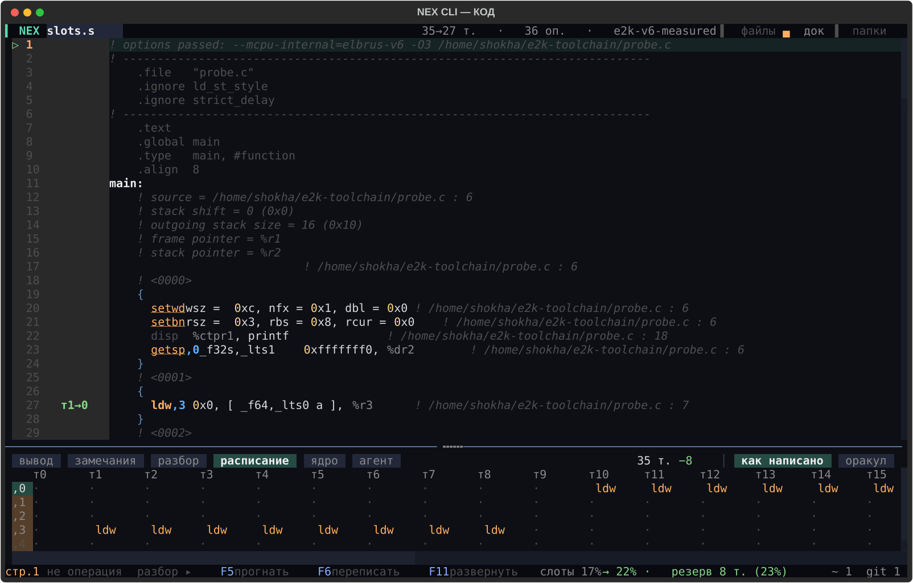
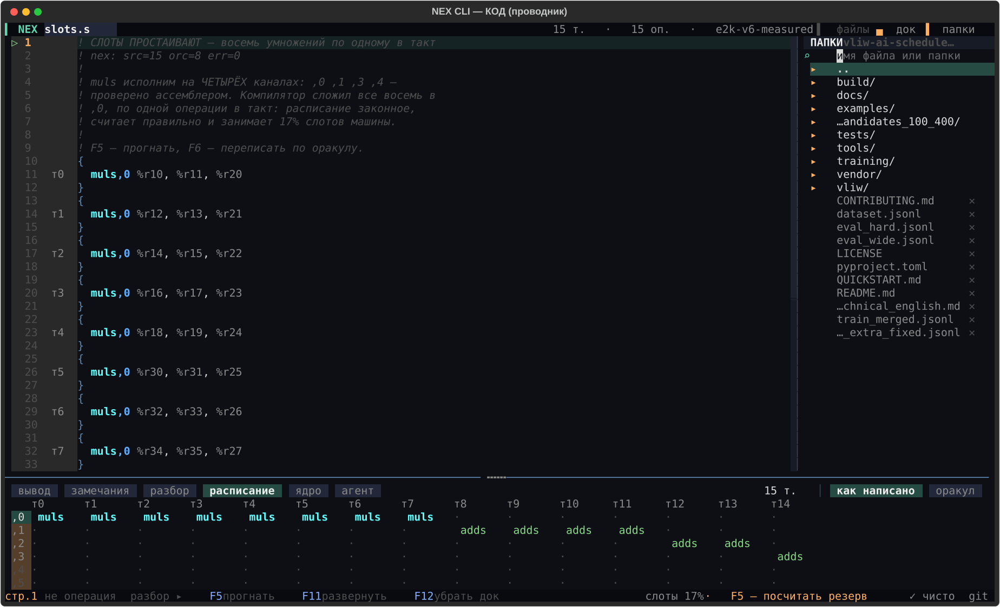

# Режим КОД — полный разбор

Единственный режим, который работает с НАСТОЯЩИМ ассемблером — тем, что
выдал `lcc`, а не встроенными сценариями. Открывается `python -m vliw code`
или клавишей `1` на экране выбора. Здесь редактор, живой разбор расписания
прямо в номерах строк, и три способа принести файл: положить в рабочий
каталог, открыть проводником, вставить командой.

Это одна из двух глубоко описанных панелей проекта — вторая
[РАЗБОР](LAB_MODE.md). АГЕНТ и ЯДРО намеренно не расписаны так подробно:
первый по сути один диалог, а миниатюрная версия ЯДРА живёт прямо здесь,
вкладкой дока (см. ниже).

## Первый запуск

Пока ничего не открыто, экран объясняет себя сам — статичный текст
`code-hello`, который исчезает с первой же разобранной операцией. Дальше по
умолчанию открыт встроенный пример `slots.s`: восемь независимых умножений,
уместившихся в компиляторе по одному в такт вместо четырёх, — готовый повод
нажать F5 и увидеть разницу.

## Что на экране

```
▍NEX  slots.s              15 т. · 15 оп. · e2k-v6-measured   ▌файлы ▄док ▐папки
▷  1     ! комментарий
   2  т0   muls,0 %r10, %r11, %r20     ← номер строки, такт, код
   ...
стр.1  не операция  разбор ▸  F5 прогнать  F11 развернуть  F12 убрать док   слоты 17%  ✓ чисто  git
```

Тот же экран — настоящий снимок, `examples/probe.s` разобран и прогнан:



Шапка — имя текущей вкладки, живой счёт (тактов и операций), профиль машины,
три кнопки-переключателя справа. Подвал — одна строка состояния: курсор
слева, итог по буферу справа. Между ними — редактор с гуттером: номер строки
плюс, если разобрано, метка такта (`т0`, `т1`…) и стрелка `▷`/`▸` у строки
под курсором.

## Три переключателя в шапке

| кнопка | клавиша | что открывает |
|---|---|---|
| `▌ файлы` | `^B` | колонка слева: список открытых вкладок + «завести» новый участок/заметку |
| `▄ док` | `F12` | нижняя панель с шестью вкладками (см. ниже) |
| `▐ папки` | `^E` | проводник справа: файловая система, не каталог примеров |

Все три — обычные тумблеры: то же нажатие закрывает то, что открыло. `▌
файлы` **не каталог примеров** (те открываются кликом по имени в самом
списке `+ участок e2k`, если внутри буфера набрана «/» — заготовки
подставляются командой), а именно список того, что уже открыто у вас в
работе.

## Клавиши

| клавиша | действие |
|---|---|
| `F5` | прогнать буфер: разобрать, посчитать baseline и точный поиск |
| `F6` | переписать буфер по расписанию точного поиска (см. оговорку ниже) |
| `F11` | развернуть/свернуть текущую вкладку дока на весь низ экрана |
| `F12` | показать/убрать нижний док целиком |
| `F2` | переименовать текущую вкладку |
| `^S` | сохранить. Если у вкладки уже есть путь на диске — молча пишет туда же; если файл с таким именем уже существует — не перезаписывает без спроса, подставляет команду в строку ввода |
| `^P` или `/` | строка команд (то же самое, что построчный режим, но внутри экрана) |
| `^G` | объяснить: полный разбор строки под курсором |
| `^E` | проводник (то же, что кнопка «папки») |
| `Esc` | один шаг назад: сначала подсказка автодополнения, потом проводник (если открыт), потом вкладка агента дока, потом развёрнутая вкладка, и только после всего — выход из режима |

`F2` в КОДе — **не то же самое**, что `F2` в РАЗБОРЕ (там это фокус решётки).
Один и тот же жест значит разное в разных режимах — это не опечатка, это
две разные клавиатурные карты.

## Шесть вкладок дока

Открываются `F12` (весь блок) или кликом по конкретному пункту статус-бара
внизу — каждая заводится независимо:

| вкладка | что внутри |
|---|---|
| **вывод** | журнал команд и прогонов — то же, что видно в консоли построчного режима, только здесь |
| **замечания** | список находок линтера с номерами строк — кликабельны, ведут курсор к строке |
| **разбор** | полный разбор строки под курсором: кто кормит операцию операндами, что с ней сделает точный поиск |
| **расписание** | та же решётка тактов×каналов, что в РАЗБОРЕ, но для буфера КОДа |
| **ядро** | **миниатюрная версия режима ЯДРО прямо здесь** — свой ввод (`a = 10`, `sum 8`, `go`), своя лента, готовые ядра и глаголы кликабельными чипами. Не нужно выходить из КОДа, чтобы посчитать выражение |
| **агент** | **миниатюрный диалог**, тот же принцип, что в полном режиме АГЕНТ: своя строка вопроса, справа «что видит агент» и «трасса» действий |

`F11` разворачивает ТЕКУЩУЮ вкладку дока на весь низ экрана — удобно для
«замечания» на длинном списке или «расписание» на широком графе.

## Клик по строке курсора внизу

В статус-баре слева — `стр.N` с кратким разбором (операция, латентность).
Клик по этой надписи разворачивает вкладку «разбор» целиком: прогрессивное
раскрытие вместо постоянной колонки, которая отбирала бы место всегда ради
того, что нужно изредка.

## F6 — важная оговорка

F6 переписывает буфер расписанием точного поиска: те же мнемоники и
операнды, изменены только каналы и разбивка на широкие команды. Это
единственное место инструмента, которое **пишет** код, и есть настоящее
ограничение: планировщик строит граф зависимостей только по истинным
зависимостям (чтение после записи). Антизависимости (запись после чтения)
он не моделирует намеренно — для АНАЛИЗА это правильно, их снимает
переименование регистров. Но переписывание кладёт операции обратно **с теми
же именами регистров**, и в редких случаях (когда оракул законно переставил
операцию так, что она пишет регистр раньше, чем предыдущий читатель успел
его прочитать) получившийся текст перестаёт быть корректным.

Если это произошло — F6 честно скажет, сколько ошибок нашла собственная
проверка, вместо того чтобы молча объявить успех. Правка через `^Z`
отменяется как любая другая. Прежде чем сохранять переписанный буфер —
проверяйте вкладку «замечания».

## Проводник (`^E`, «папки»)



Показывает **файловую систему**, не встроенные примеры: один каталог за раз
(папки, потом файлы), сверху `..` и до трёх недавних каталогов (`↩`) —
удобно прыгать между двумя рабочими местами без похода наверх каждый раз.

**Поиск.** Строка `⌕ имя файла или папки` ищет вглубь (до 4 уровней,
обходом вширь — свои файлы ближе к корню находятся раньше, чем то, что
лежит в `vendor/`). Находит и файлы, и папки: клик по найденной папке
заходит внутрь, по файлу — открывает вкладкой.

Понимает не только имя, но и **путь целиком** — можно вставить
`examples/stress/deep/hard_mix.s` и найти именно его. Windows-путь с
обратными слэшами (`examples\stress\deep\hard_mix.s`) тоже понимается:
разделители приводятся к одному виду.

**Одна шероховатость, о которой честно.** Колонка поиска получает фокус на
кадр позже, чем открывается, и мгновенная вставка (Ctrl+V сразу после ^E)
может опередить его: часть символов тогда уходит в редактор. Признак —
мусор в первой строке кода и обрезанный запрос в поиске. Лечится просто:
после ^E сделайте паузу в полсекунды, потом вставляйте. Чинится это не
косметикой, а переносом фокуса на синхронный путь — сделано не будет
наспех.

**Удаление (`✕` справа от строки).** Один клик по `✕` не удаляет файл сразу
— переспрашивает («удалить ИМЯ? / да, удалить / отмена»), и только «да,
удалить» стирает файл с диска, без возможности отменить. Кнопка есть только
у файлов **рабочего каталога** — у встроенных примеров пакета её нет
специально, стереть их промахом мимо имени нельзя.

**Проверка на настоящем примере.** В `examples/stress/` лежат два файла
специально для проверки этого механизма — они же честные стресс-тесты
самого планировщика:

- `examples/stress/warmup/basic_pipeline.s` — короткий разогрев (11 → 9
  тактов), три вида давления сразу: загрузка, умножения, свёртка сложением
- `examples/stress/deep/hard_mix.s` — тяжёлый случай: монополия делителя,
  восемь независимых умножений, цепочка загрузок, плавающая точка (35
  операций, **31 → 16 тактов, резерв 48%**)

Открыв `warmup/basic_pipeline.s`, дойдите до `deep/hard_mix.s` через `..`
— обе папки должны появиться в недавних (`↩`) одним нажатием, без повторного
похода через `examples/`. Оба файла — **не вывод lcc**, написаны руками для
этого проекта; граница между настоящим кодом и синтетикой — в
[REAL_VS_SYNTH.md](REAL_VS_SYNTH.md).

## Новый буфер (`▌ файлы` → «завести»)

Два вида, оба с заготовкой внутри, а не пустым экраном:

- **«+ участок e2k»** — новый `.s`, комментарий-подсказка `F5 прогнать, «/» команды`
- **«+ заметка»** — `.md`, для «что пробовал и что вышло»

Имя даётся сразу по порядку («участок 2»), не спрашивается — переименовать
можно в любой момент клавишей `F2`.
